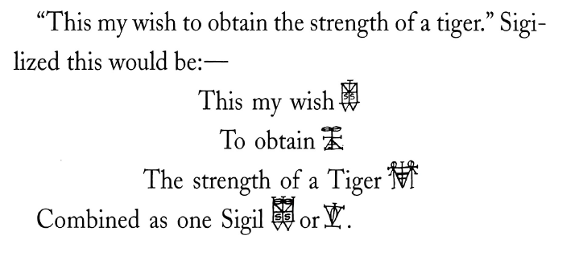

## 🇬🇧 The Magical System of Sigils

Having established the essentials of the Zos Kia Cultus it is now possible to
move on to the details of the magical system of Spare's sigils. The main aim of the
sigils was learning through enjoyment. Spare wrote: “Sigils are the art of believing;
my invention for making belief organic, ergo, true belief.”ix The true desire of a
person is the starting point of creating a sigil. This desire should be written on
paper by formulating it in a short sentence. Then, the letters of the sentence have to
be reformulated by creating a glyph.x The next example illustrates the process of
converting a true desire into a sigil.
In this example, Spare wished to obtain the strength of a tiger. In order to
sigillize this desire, he put down on a piece of paper all the letters of which the
sentence is composed, avoiding repetitions. Then, the sequence of letters is
combined to form a single glyph.

 

Next, Spare stresses that after the wish has been sigillized, it has to be forgotten.
Its creator must resist thinking about it consciously.xiii Instead, the creator must
think of the sigil during ‘the magical time’, meaning any moment in which a person
is convulsed by emotional or elemental reactions, for example, during an orgasm,
pleasure, pain or rage.xiv
Spare saw ‘the magical time’ as an open concept, which depended on the temperament
of the creator of the sigil, and gave a wide range of examples of what it
could mean including mantras, posturesxv, women and wine, tennis, the playing of
patience or walking while focusing on a sigil.xvi One reason for this vagueness is
likely his thought that the sigils work at the subconscious level and it is not possible
to instruct their actualization consciously.
Grant sums up the two main aims of Spare's sigils by highlighting the importance
of the subconscious activity in his magical system.

> Sigils and the Alphabet of Desirexvii are used specifically to enable two
things to occur. 1. Effective communion with elementals existing at
subconscious levels. 2. The lodging of the desire or wish at such levels
without the conscious mind being aware of the transaction, for 'conscious
desire is unattractive'.

Exploring the sigils in the context of Spare's Zos Kia Cultus clarifies not only
the terms he used but also his magical system as a whole. In addition, it highlights
the fact that Zos Kia Cultus’ magic refers not only to concrete sex rituals, but also
to the creative process of the artist. Moreover, the symbols of the cult explain the
magical system of sigils in following way,

> The hand signifies the phallic will, the creative urge to do or to
make. The composite glyph of the hand and the eye therefore
contains a simple formula: the Will and its means of expression through
the agency of desire, or imagination.xix

It is important to add that the actual sigil which we can see does not contain
magical power. It is rather a vehicle of the desire whose power actualizes at the
subconscious level of the creator. xx These facts offer a justified basis for analysing
the sigils from their material and aesthetic level, as we know one of the intended
purposes of Spare’s cult was to create art. In the literature on Spare's magical art
his dual role as magician and artist has been highlighted without exception.

---

© 2025 知られざる呪術師（Le Sorcier Inconnu）
本ドキュメントは Creative Commons BY-SA 4.0 に基づき公開されています。

