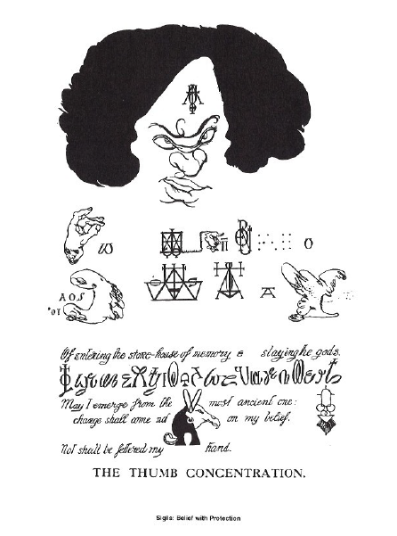

# 『オースティン・オスマン・スペアの紋章の魔術体系』翻訳Zine

このZineは、Riikka Ala-Hakula による論文 “The Magical System of Austin Osman Spare's Sigils” の全文を、翻訳と注釈を通して再構成したものです。

本論文は、オースティン・オスマン・スペアが提唱した紋章魔術（Sigil Magic）を、記号論・芸術理論・身体性の観点から分析するものであり、ZOS/KIAの理解とシジル化技術の背景を探る貴重な資料です。

---

 

---

# 『オースティン・オスマン・スペアの紋章の魔術体系』翻訳Zine

このZineは、Riikka Ala-Hakula による論文 “The Magical System of Austin Osman Spare's Sigils” の全文を、翻訳と注釈を通して再構成したものです。

本論文は、オースティン・オスマン・スペアが提唱した紋章魔術（Sigil Magic）を、記号論・芸術理論・身体性の観点から分析するものであり、ZOS/KIAの理解とシジル化技術の背景を探る貴重な資料です。

---

### 🔹 Chapter 1: はじめに

スペアの魔術体系の背景と、アセミック・ライティングという視点からの問題提起。

- 紋章（シジル）とは何か？
- アセミック・ライティングとは？
- 本論文の目的とアプローチ

👉 [クリックして読む](01_intro.md)

---

### 🔹 Chapter 2: スペアのオカルト信仰の背景

クロウリーとの対比を含め、スペアの実践の個別性を探る。

- 左手の道と性的魔術
- パターソンの影響
- 芸術と魔術の重なり

👉 [クリックして読む](02_background.md)

---

### 🔹 Chapter 3: ZOS/KIAの象徴的構造

ZOS＝手、KIA＝目という象徴系の提示と、その意味するところ。

- All Sensing Touch / All Seeing Vision
- 身体と宇宙的自己
- シジルの根幹構造

👉 [クリックして読む](03_zos_kia.md)

---

### 🔹 Chapter 4: 紋章化の魔術技法

スペアの紋章生成手法の詳細と、願望の忘却による潜在意識操作。

- 願望 → 文 → 記号 → 忘却 → 情動で再起動
- Death Posture / Emotional Charge
- Alphabet of Desire との関連

👉 [クリックして読む](04_sizil_magic.md)

---

### 🔹 Chapter 5: 難解な記述としての紋章

シジルを記号論・モノグラム・アセミックな芸術表現として分析。

- ロイ・ハリスの理論との接続
- 表記体系 vs 芸術行為
- シジルの声なき言語性

👉 [クリックして読む](05_esoteric_script.md)

---

### 🔹 Chapter 6: 結論

魔術と芸術の交差点としての紋章を再評価し、現代的意義を問う。

- ハイパーシジルとの接続
- 大衆文化への拡張
- Spareの方法の再活性化

👉 [クリックして読む](06_conclusion.md)

---

## 📚 補遺：ZOS/KIA原典引用と図解

Zineの巻末には以下を収録予定：

- Spare本人によるZOS/KIAの原文抜粋（『The Book of Pleasure』ほか）
- ZOS＝手、KIA＝目を基盤とした視覚図解
- ケネス・グラントによる「Zos Kia Cultus」概念の注釈

---

## 🔖 免責・著作権に関する注意

本Zineは研究・学術・非営利目的で公開されており、出典を明記したうえで原文の部分引用・翻訳を行っています。

----

© 2025 知られざる呪術師（Le Sorcier Inconnu）
本ドキュメントは Creative Commons BY-SA 4.0 に基づき公開されています。

